# Binomial Tree for Options Pricing
### Motivation:
Started as a project for learning in relation to schoolm but turned out as a tool that 
could be useful for more.

## What does it do?
This class will construct/calculate/make/whatever a binomial tree with given parameters 
and calculate option prices for both American and European Call and Put options.

- The class will make tree objects with Dataframe representation 
(except for non-recombining trees).
- The `write()` method will generate an Excel file with the result.

### Dividends
The class can take dividends into account (dividend yield **and** discrete dividends). 
It has 2 ways of solving for discrete dividends, the 'F solution' and 'non-recombining'.

#### F solution
Subtracts the present value from current spot, and makes binomial tree based on this
'pre-paid forward'. 

#### Non-recombining tree
As the name suggests, the tree does not recombine after dividend payout and calculates
the option premium as normal (assumes that we can trade just before and after 
stock goes ex-div)

***

# Full parameter specification
[Parameters specification](docs/parameters.md)

***

# How to pass parameters/arguments:
There are 2 ways of parsing arguments:
1. A dictionary
2. Keyword arguments (kwargs)
   
If both a dictionary and keyword arguments are parsed they will join together. 
Keyword arguments will override any parameters passed in both the dictionary and 
as keyword arguments.

***

# Which parameters to pass:
*If nothing is passed, the `help()` method will print help for specifying parameters*  


## Spot and strike
#### Both must be passed
- `spot`
- `strike`

***

## Time and period specification
Must be in terms of years (e.g., maturity in 6 months would be *T = 6/12* ).  
The variable `dtfreq` can be passed as a string (`'d'`, `'w'`, or `'m'`) for
prettier formatting in output.
#### 2 of 3 must be passed   
- `T`
- `dt`
- `periods`

***

## Interest rate, dividend yield, and continuous compounding
#### 0 of 3 *must* be passed
- `r`
- `rcont`
- `divyield`

***

## Volatility and up/down movements
#### 1 of 3 must be passed
- `vola`
- `u`
- `d`

For custom function for calculating up/down movements, 
see [udfunc specification](docs/parameters.md#udfunc).

***

## Dividends
#### 0 of 2 *must* be passed
- `discdiv`
- `nonrec`

***

## Directory for Excel output
#### 0 of 4 *must* be passed
- `direc`
- `folname`
- `fname` 
- `write`

***

## Various
#### 0 of 5 *must* be passed
- `collapsed`
- `maketrees`
- `headerformat`
- `rounding`
- `makedfs`
- `portfolios`
- `showIntrinsic`

***

# Examples of use
### imports
```python
from main import binomialTrees
```

***

## Normal tree
Simple 3-period binomial tree:

```python
parsNormal = dict(fname = 'NormalTree', 
                  spot = 100, strike = 95, 
                  dt = 1/12, periods = 3, 
                  vola = 0.20, r = 0.05, 
                  showIntrinsic = True, # True is default
                  dtfreq = 'm', rounding = 4)  

binoNormal = binomialTrees(params = parsNormal)
```

### Tree preview
The binomial tree for the European Call is accessed by `binoNormal.ecTree`  
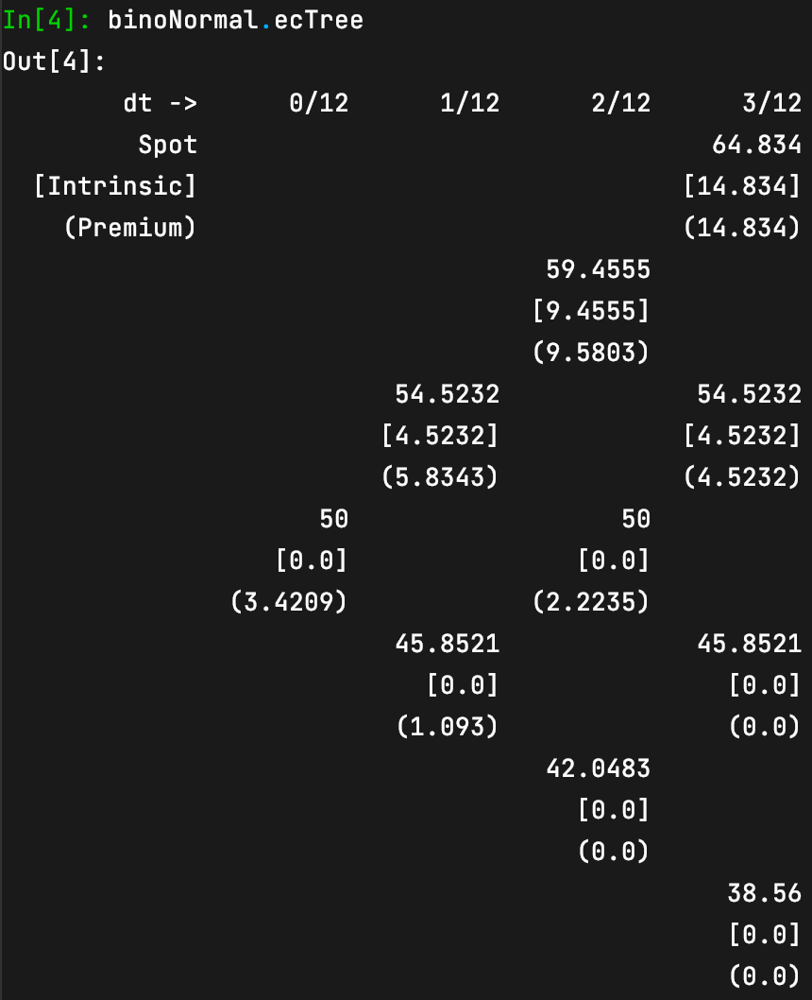  


### Callable tree
In case your binomial tree is big and won't print neatly you can access each node by 
calling the tree object with `up` and `down` passed:  
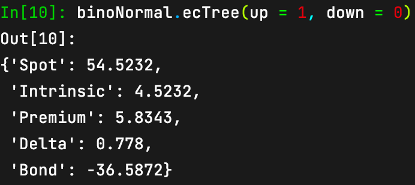


### `write()` method
typing `binoNormal.write()` in the console an Excel file will be generated. Either in the
current working directory, or passed directory through the `dir` parameter.  
The location of the file should be printed.  
```python
binoNormal.write(fname_override = 'NEW_FILENAME',
                 width = "{your file window width}", height = "{file window height}")
```
`File was made at: {your directory here}/NEW_FILENAME.xlsx`  
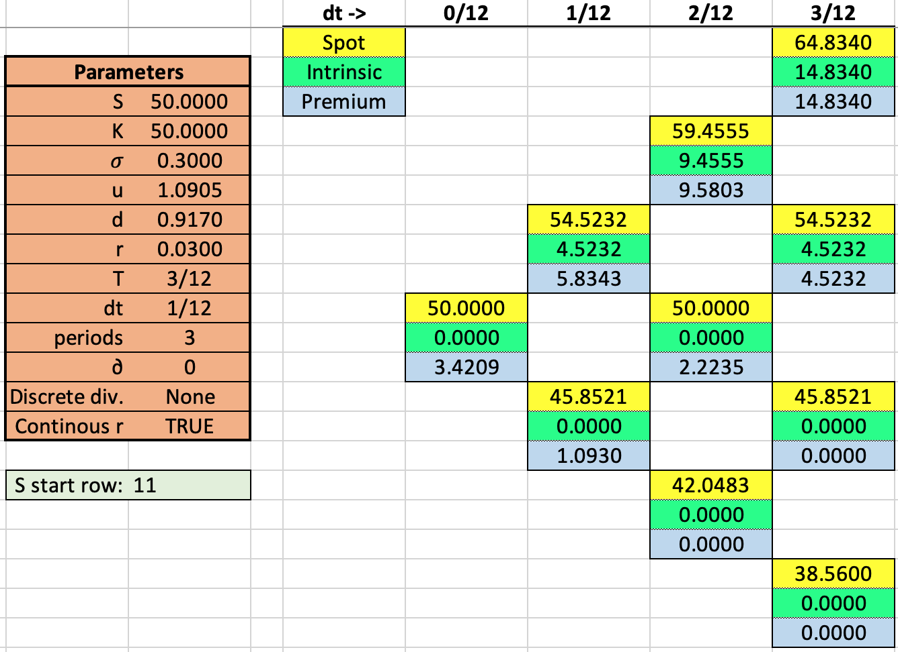


***

## Plotting methods
The plotting methods can take in keywords to alter the original parameters

\
**Plotting deltas w.r.t. current spot:**
### `binoNormal.ecPlotDeltas()`  
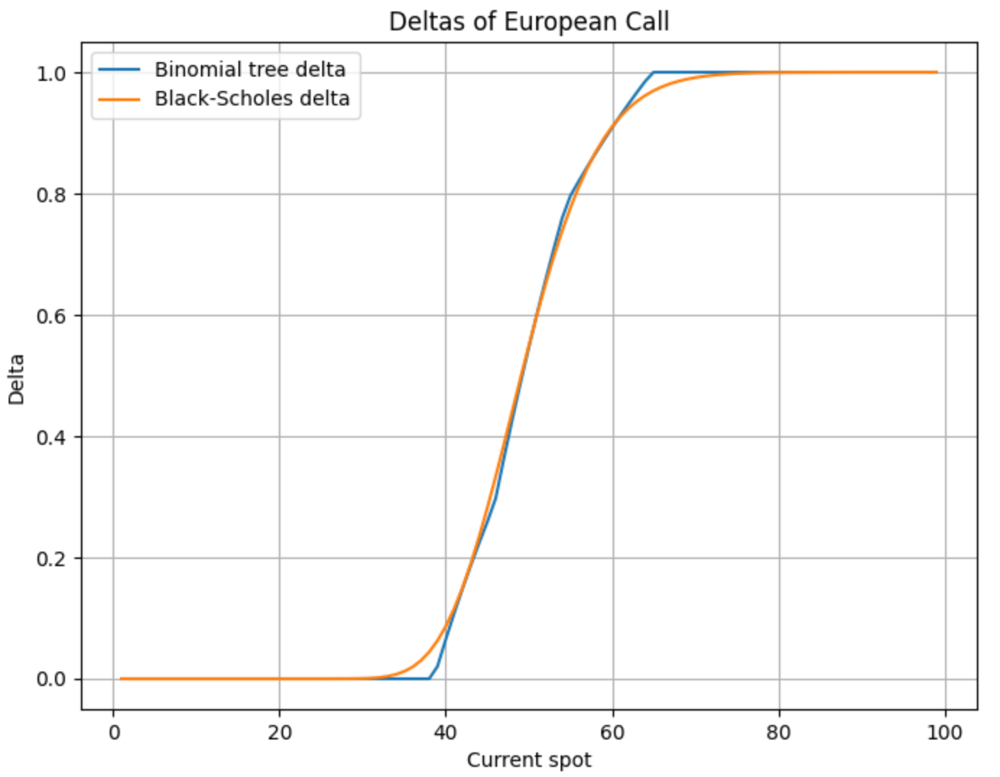  


\
Changing periods for plot to make it smoother:
### `binoNormal.ecPlotDeltas(periods = 30)`  
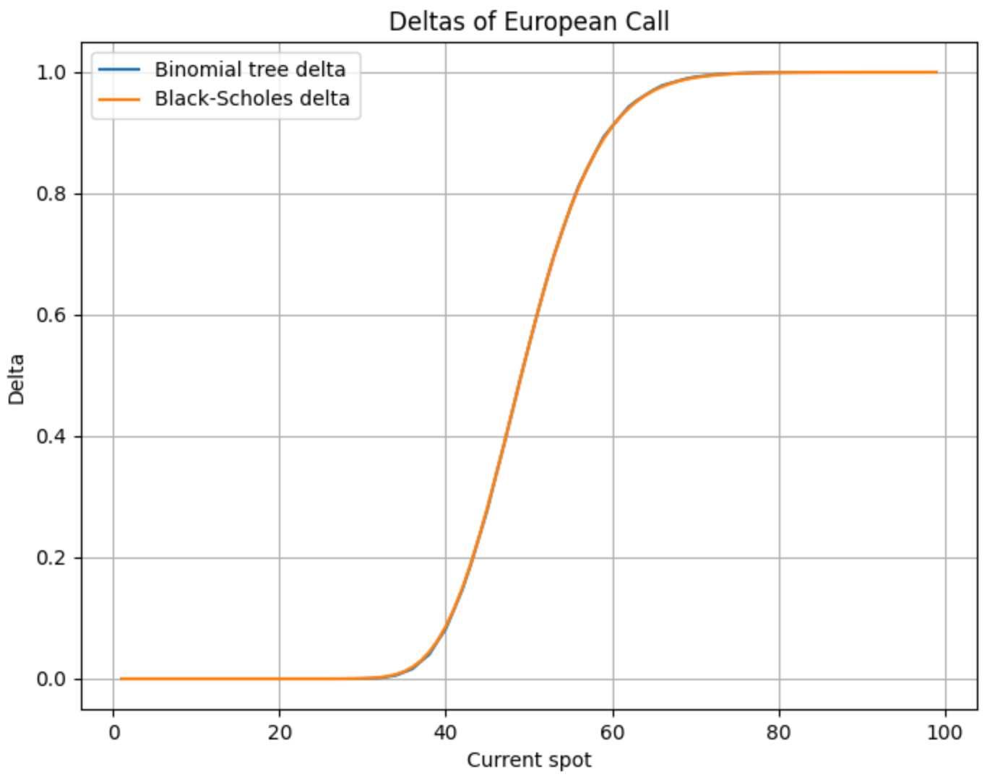  


\
**Plotting price w.r.t. current spot:**
### `binoNormal.ecPlotPrice()`  
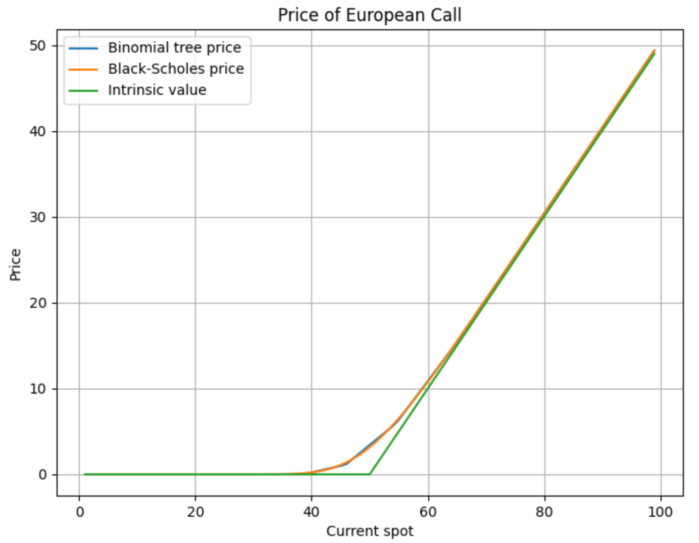  


\
Changing strike for plot:
### `binoNormal.ecPlotPrice(strike = 40)`  
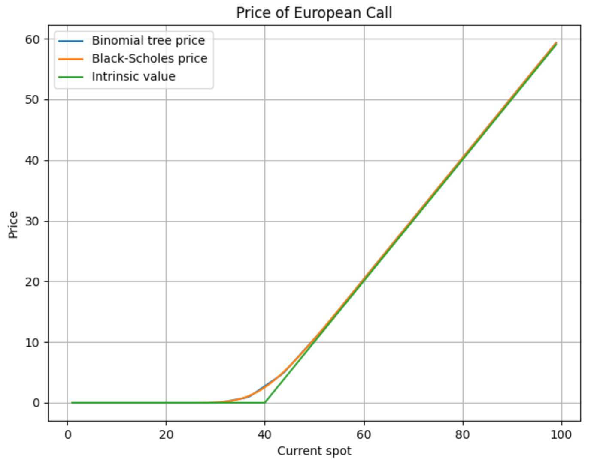  


\
**Plotting price w.r.t. periods used in binomial tree:**
### `binoNormal.ecPlotPeriods()`  
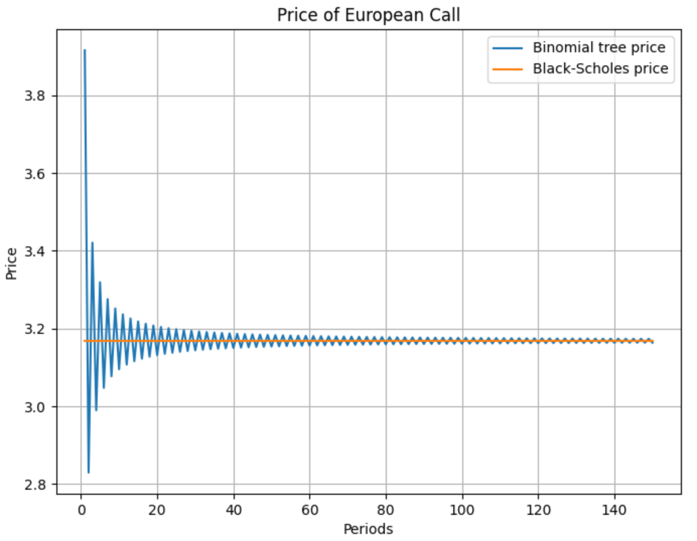  


\
**Plotting binomial spot tree with distribution of last period:**
### `binoNormal.plotSpots()`  
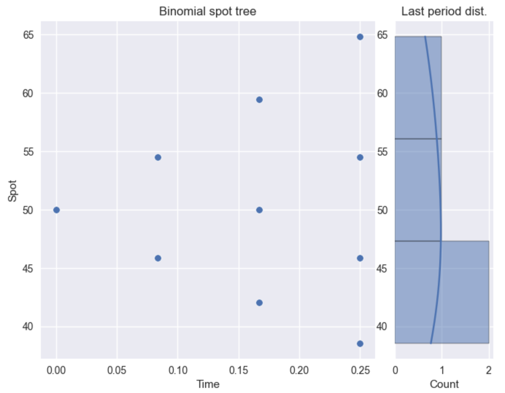  


\
Changing number of periods in tree (with `T` remaining the same)
### `binoNormal.plotSpots(periods = 30)`  
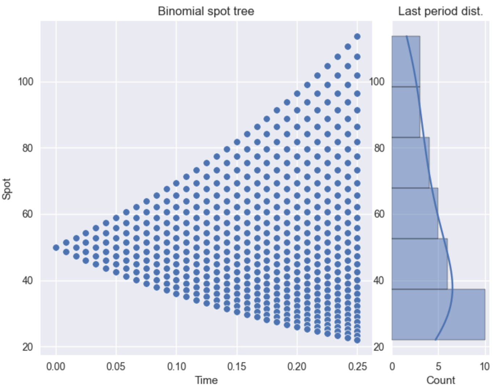  


***

## Replicating `portfolios`
The program calculates option prices in each node through risk-neutral pricing, 
then calculates the replicating portfolios after (it was faster that way).  
Any difference between the risk-neutral pricing result, and the replicating portfolio pricing should
only be due to rounding errors.  

Setting the `portoflios` parameter to `True` will include the replicating portfolios as
separate sheets in the Excel file. (This will slow down excecution, especially if `periods` is high)

```python
binoNormal = binomialTrees(params = parsNormal, 
                           rounding = 2,
                           portfolios = True, 
                           write = True # setting write to True makes an Excel file from construction
                           )
```  
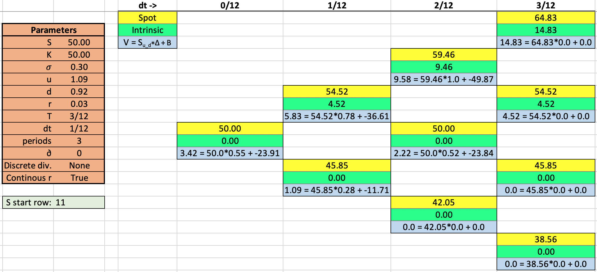  
**! The errors are to be fixed !** 

***

# Discrete dividends
Discrete dividends can be passed through the `discdiv` parameter:  
```python
discdiv = [(1/12, 2)]
```

## F tree
For discrete dividends, the F solution will be the default as it is faster than nonrec:

```python
parsF = dict(fname = 'Ftree', 
             spot = 50, strike = 50, 
             dt = 1/12, periods = 3, 
             vola = 0.30, r = 0.03, 
             dtfreq = 'm')

binoF = binomialTrees(params = parsF, discdiv = [(1/12, 2)])
```

***

## Non-recombining tree
For discrete dividends -> non-recombining tree.  
Obtained by passing `nonrec` as `True`

```python
parsNonrec = dict(fname = 'nonrecTree',  
                  spot = 50, strike = 50,  
                  dt = 1/12, periods = 3,  
                  vola = 0.30, r = 0.03,  
                  dtfreq = 'm')

binoNonrec = binomialTrees(params = parsNonrec, discdiv = [(1/12, 2)], nonrec = True)

binoNonrec.write()
```
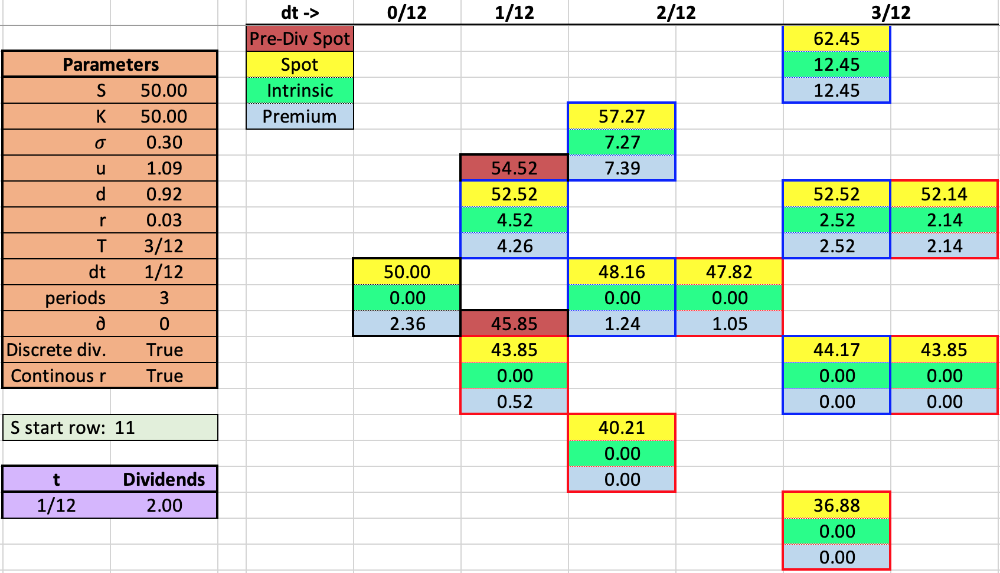  

***

# Object as callable
The binomialTrees object is callable, meaning an instance of the object can be 
used as a function.  
This can be handy for getting values in loops or quickly getting new values without 
re-specifying all the parameters.  
As a default the class will make american call and put, aswell as european call and put, 
unless the `maketrees` keyword states otherwise. If only one or some specific option types
are needed, it would be more efficient to specify which types to make.

### Example:
*As periods becomes large (i.e., dt becomes small), the rounding parameter needs to be 
sufficiently large to avoid miscalculation.*
```python
pars = dict(fname = 'myTree', 
            spot = 50, strike = 50, 
            dt = 1/12, periods = 3, 
            vola = 0.30, r = 0.03, 
            dtfreq = 'm', rounding = 8)

binoNormal = binomialTrees(params = pars, maketrees = ['ec', 'ep'])

ec_ep_50periods = binoNormal(['ecOptionPrice', 'epOptionPrice'], periods = 50)  
```
```python
ec_ep_50periods = {'ecOptionPrice': 3.15373942, 
                   'epOptionPrice': 2.78014216}
```  

Returns the european call and put price with all parameters remaining the same, 
except periods being 50.  


### In a loop:
```python
ecList = []

for i in range(1, 100):
    ecList.append(binoNormal(['ecOptionPrice'], maketrees = ['ec'], periods = i))
```
Makes a list of the european call price.


***